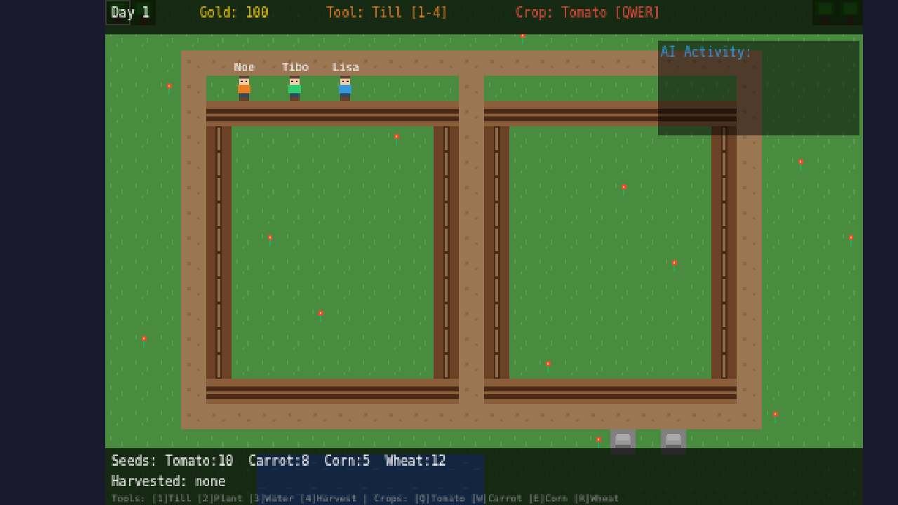

# AI-Driven Retro Farm

A pixel-perfect retro farming simulation where AI agents tend a dynamic, tilemap-driven world. Built with **Phaser 3** and integrated with backend **LLMs** via a closed-loop observation → generation → injection engine.



> Live demo: [https://jean-clawd.com/lab](https://jean-clawd.com/lab)

## The Blueprint Distilled

1. **State is Data:** Store all entity variables in the Phaser Data Manager for instant serialization.
2. **Logic is Headless:** Isolate the AI WebSocket stream in its own invisible parallel scene.
3. **Input is Strict:** Treat LLM outputs as untrusted data; force JSON schema validation through a local dispatcher.
4. **Injection is Native:** Exploit Tiled 2D arrays and dynamic textures to manipulate the world instantly at runtime.

*Build the farm. Let the AI tend it.*

## How to Play

- **Click** tiles to interact with the selected tool
- **`[1]` Till** → **`[2]` Plant** → **`[3]` Water** → **`[4]` Harvest**
- Switch crops: **`[Q]`** Tomato · **`[W]`** Carrot · **`[E]`** Corn · **`[R]`** Wheat
- Watch Noe, Tibo and Lisa (the AI agents) autonomously farm alongside you

## Tech Stack

| Layer | Technology |
|---|---|
| Game Engine | Phaser 3.90.x |
| Language | TypeScript |
| Build Tool | Vite |
| Backend (planned) | FastAPI + LangGraph |
| Memory Store (planned) | MongoDB |
| LLM (planned) | Claude API |

## Quick Start

```bash
npm install
npm run dev
```

Or build for production:

```bash
npm run build
npm run preview
```

## Architecture

Three parallel Phaser scenes:

- **`WorldScene`** — tilemap, agents, farming mechanics, game state
- **`UIScene`** — HUD overlay (gold, day, tools, AI activity log)
- **`AIManagerScene`** — headless AI loop: observe → generate → inject

Every 6 seconds the AI serializes the full game state to JSON, runs its decision logic, and injects validated actions back into the world. Currently using heuristics; designed to swap in a real LLM call over WebSocket.

## Documentation

- **[RETRO_FARM_SPEC.md](./RETRO_FARM_SPEC.md)** — Full technical specification
- **[PRD.md](./PRD.md)** — Product requirements document
- **[TECH_SPEC.md](./TECH_SPEC.md)** — Original AI-Office technical spec
- **[AUTONOMOUS_OFFICE.md](./AUTONOMOUS_OFFICE.md)** — Blueprint distilled from slide deck
